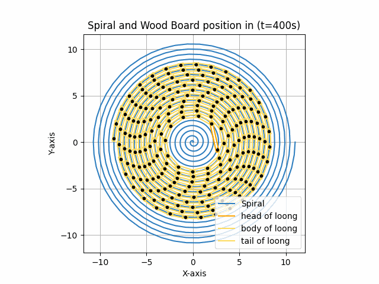

# Mathematical Modeling of Spiral Motion


> 🏆 First Prize Winner in 2024 Contemporary Undergraduate Mathematical Contest in Modeling (CUMCM) - Provincial Level

This project provides a mathematical solution for analyzing the motion on an Archimedean spiral, focusing on position calculation, velocity analysis, and trajectory optimization.

## 📋 Table of Contents

- [Problem Overview](#-problem-overview)
- [Project Structure](#-project-structure)
- [Solution Approach](#-solution-approach)
- [Results Visualization](#-results-visualization)
- [Installation & Usage](#-installation--usage)
- [Technical Details](#-technical-details)
- [Contributors](#-contributors)

## 🎯 Problem Overview

The problem involves analyzing the motion of connected points on an Archimedean spiral with the following characteristics:
- Pitch (p) = 55cm
- Initial position at 16th turn
- Fixed distances between consecutive points (286cm for first interval, 165cm for others)
- Constant speed of the leading point (1m/s)

## 📁 Project Structure

```
.
├── codes/
│   ├── calculate_head_p.py    # Calculate leading handle position
│   ├── calculate_next_p.py    # Calculate following points' positions
│   ├── calculate_v.py         # Compute velocities
│   └── circle_equation.py     # Handle circular trajectory calculations
├── Results/
│   ├── problem1_animation.gif # Position analysis visualization
│   └── problem2_animation.gif # Velocity analysis visualization
├── competition essay/
│   └── 我的论文.pdf           # Competition paper
├── README.md                  # English documentation
└── README_zh.md              # Chinese documentation
```

## 💡 Solution Approach

### Problem 1: Position Analysis
Developed a mathematical model to track positions of all points on the spiral:
- Used arc length integration for the leading point
- Applied geometric constraints for following points
- Implemented numerical methods to solve implicit equations


### Problem 2: Velocity Analysis
Analyzed velocity relationships between consecutive points:
- Derived velocity transfer equations based on geometric relationships
- Implemented numerical solutions for velocity ratios
- Analyzed velocity variations along the spiral



### Problem 3: Trajectory Optimization
Optimized the motion path considering:
- Minimum turning radius constraints
- Smooth transition requirements
- Path length optimization
- Curvature analysis at critical points

### Problem 4: Stability Analysis
Investigated the stability of the system:
- Analyzed the impact of perturbations
- Studied system response to disturbances
- Evaluated stability conditions for different configurations

### Problem 5: Model Extension
Extended the model to consider:
- Variable speed scenarios
- Different spiral configurations
- Alternative geometric constraints
- Practical implementation considerations

## 🛠 Installation & Usage

```bash
# Clone the repository
git clone https://github.com/yourusername/spiral-motion-modeling.git

# Install required packages
pip install numpy scipy matplotlib

# Run position analysis
python codes/calculate_head_p.py

# Run velocity analysis
python codes/calculate_v.py
```

## 🔧 Technical Details

- **Programming Language**: Python 3.8+
- **Key Libraries**:
  - NumPy: Numerical computations
  - SciPy: Integration and optimization
  - Matplotlib: Visualization and animation
- **Mathematical Tools**:
  - Arc length integration
  - Implicit function solving
  - Geometric optimization
  - Differential equations
  - Numerical methods

## 👥 Contributors

- Team Members from Sichuan University
- [Gixyuan](https://github.com/Gixyuan)
- [SunXiaotian](https://github.com/sss12-22)
---

[中文版本](./README_zh.md) | [View Paper](./competition%20essay/我的论文.pdf)
